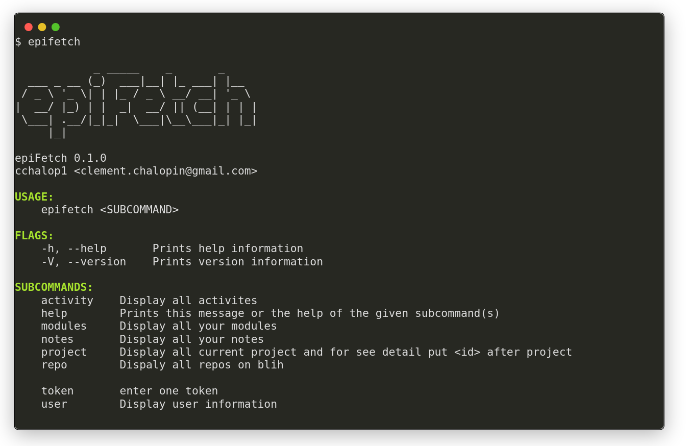

# EpiFetch

`epifetch` is a command line interface for the Epitech intranet.

EpiFetch is a cli to interact with the Epitech intranet. I created it because I'm lazy to open a browser to get a simple information and it's much faster.

[click here for install](https://github.com/cchalop1/epiFetch/releases)

[click here for read documentation](https://cchalop1.github.io/epiFetch/#/)

```
./epiftech
```



- You must have your autologin in ~/{user}/.config
- You can move epifetch to /bin to access it from everywhere or create an alias

### List of commands available presently

Command| Does...
:-----:|:-----:
`user`|Display user information
`project`|Display all current projects and to see the details put the id after the project `epifetch project <project id>`
`notes`|Display all your marks
`modules`|Display all your modules
`activity`|Display all your activities
`setacl`| to set, write on blih repository `epifetch setacl <repo name> <user> <user_right>`
`repo`| list all repositories on blih server add `epifetch repo <name new repo>` to create a new repo


### Contributing

1. Fork it (<https://github.com/cchalop1/epifetch/fork>)
2. Create your feature branch (`git checkout -b feature/fooBar`)
3. Commit your changes (`git commit -am 'Add some fooBar'`)
4. Push to the branch (`git push origin feature/fooBar`)
5. Create a new Pull Request

## This project is a work in progress !!!

your contribution is welcomed ! ! !

## Contact

Clément Chalopin - [@cchalop1](https://twitter.com/ChalopinClement) - clement.chalopin@gmail.com
